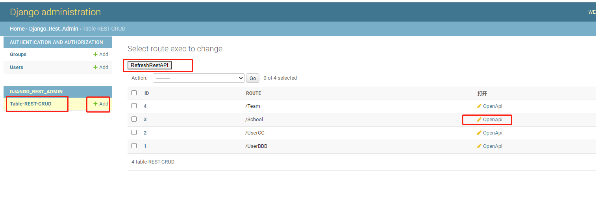
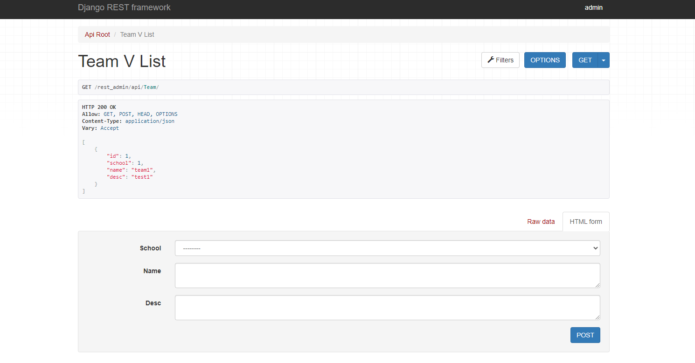

# django_rest_admin
Adding table CRUD rest api with admin ui and without coding.

requirements:

1. django
2. djangorestframework
3. django-filter


install:

1. pip install django_rest_admin
2. add django app:
   in django project setttings.py file:
   INSTALLED_APPS list, add:
```
    'rest_framework',
    'django_filters',
    'django_rest_admin',
```

3. add path in project urls.py: 

```
from django.contrib import admin
from django.urls import path,include
urlpatterns = [
    path('admin/', admin.site.urls),
    path('rest_admin/', include('django_rest_admin.urls')), <<--this line is what you should add
]
```


use:
1. add table in your db:
  this could be down in navicat or some other db editors.
  of course you could coding in django,too.
  
2. open admin page: http://127.0.0.1/admin/

	

   after login, their should be a table:Table-REST-CRUD.
   press Add. 
   
   the option MUST be filled:
   
   ```
   A. route: the route name. eg: /Danwei
   B. Table big name: the model name of a table. eg: Danwei
   C. Table name: the table name. eg: danwei. ONLY needed if inspected_from_db=1
   D. Inspected from db: set to 1 if table is just from db, not from django model. otherwise set to 0.
   ```
   
   press Save
   
3. press RefreshRestAPI BUTTON in the list.
4. the django project will restart automaticly if you use debug mode.
    and then the rest api is generated already.
	press OpenApi button to test the api.
	
	
   

   


